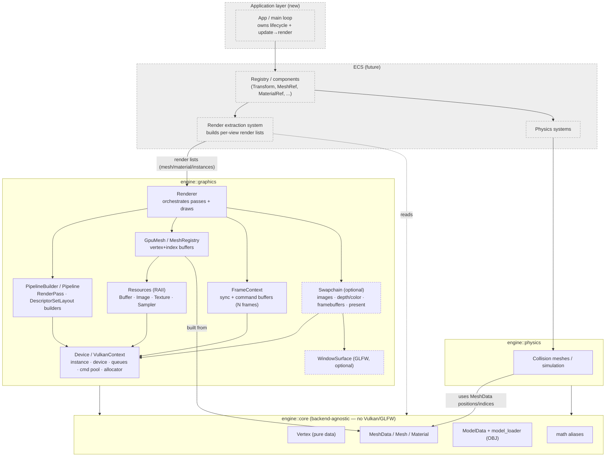
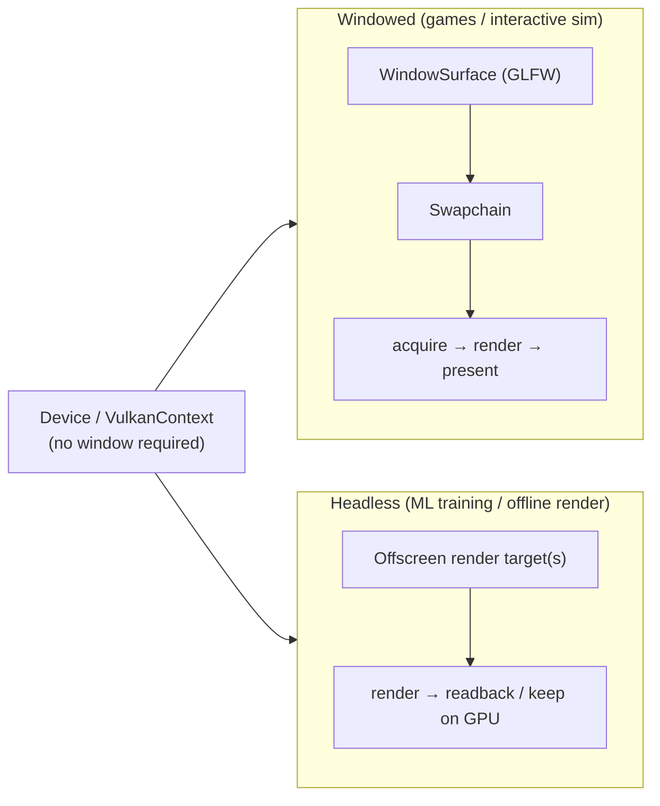
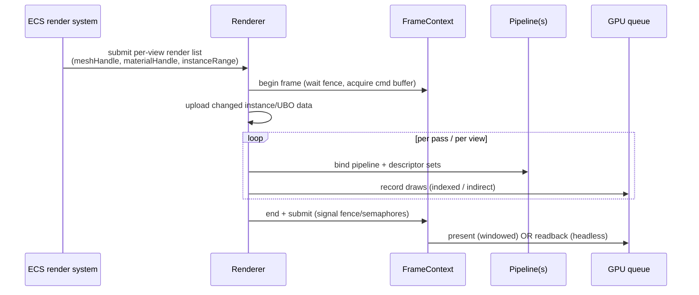

# 2026-07-01 — Graphics Library Refactor

A deep read of the graphics module and a proposed restructuring so it's usable as a
game-engine renderer: easy to create/configure/instantiate/tear down pipelines, with clear
ownership, and a shared geometry/model library usable by both graphics and physics.

Scope of read: all five `src/graphics/*.cpp` files (full) + `graphics.h` (full).

---

## 1. What exists today

One class, `Graphics`, owns the entire Vulkan stack and all scene data. ~90 methods across
five files (~115 KB). Origin is visible: file headers and error strings say "paint" /
"stamp" — this is a 2D paint app's renderer being repurposed into a 3D engine.

### Responsibilities currently fused into `Graphics`

- **Instance / device**: instance, debug messenger, surface, physical + logical device,
  queues, MSAA sample count, command pool, command buffers, sync objects.
- **Presentation**: GLFW window, swapchain, swapchain image views, color/depth resolve
  targets, framebuffers, the acquire→record→submit→present loop, resize handling.
- **Resources**: `createBuffer` / `createImage` / memory allocation via `findMemoryType`
  (one allocation per resource), staging, mipmaps, texture loading (`stbi`), sampler.
- **Fixed render path**: one `renderPass`, one `descriptorSetLayout`, one `pipelineLayout`,
  one `graphicsPipeline`, one `descriptorPool`, per-frame `descriptorSets`.
- **Scene data**: `vertices`, `indices`, `meshes`, `materials`, `textureImages/Views/
  Memories`, `drawJobs`, `instanceModelMatrices`, global UBO + instance SSBO.
- **A parallel ad-hoc framework** (`graphics_custom.cpp`) for offscreen texture→texture
  passes: generic `createRenderPass/Framebuffer/DescriptorSet(s)/Pipeline` + granular
  `record*` command helpers. This is the seed of a real API but is inconsistent with the
  swapchain path and duplicates it.

### The fixed draw path (what a pipeline currently *must* look like)

`createSwapChainDescriptorSetLayout` hardcodes exactly:
- binding 0: global UBO (view/proj), vertex stage
- binding 1: instance SSBO (`mat4 model`), vertex stage
- binding 2: `NUM_TEXTURES` (16) combined image samplers, fragment stage

plus a push constant of `{ uint32 firstMaterial, uint32 materialCount }`. Drawing
(`recordSwapChainCommandBuffer`) binds the single vertex/index buffer, then loops
`drawJobs`, pushing the material range and issuing `vkCmdDrawIndexed` with the job's
instance range.

---

## 2. Core problems (why it's unwieldy)

1. **God object / no separation of concerns.** Device lifetime, presentation, resource
   allocation, pipeline definition, and scene state all live in one class. Nothing can be
   used in isolation; everything is a member, so every new feature widens the class.

2. **Pipelines are not first-class.** There are *three* near-identical ~150-line pipeline
   builders (`createSwapChainGraphicsPipeline` + two `createPipeline` overloads in
   `_custom`). All fixed-function state (raster, blend, depth, topology, MSAA, dynamic
   state) is hardcoded inside each. Making a new pipeline = copy-paste 150 lines and edit.
   This is the single biggest pain point relative to the stated refactor goals.

3. **The descriptor/resource contract is baked into the pipeline.** The layout above is
   assumed by the shader, the descriptor writes, and the draw loop simultaneously. You
   can't add a pipeline with different inputs without touching all three.

4. **Geometry is one static, global buffer.** All meshes append into one `vertices` /
   `indices` vector; `createVertexBuffer` / `createIndexBuffer` upload once. There is no
   path to add/remove/stream geometry after init, and no per-mesh buffer ownership.

5. **Manual, centralized lifetime management.** Every object is hand-created and hand-freed
   in `cleanupVulkan()` (one long teardown). No RAII, no allocator abstraction. Easy to
   leak or double-free as the surface area grows.

6. **Presentation is hardwired into the engine.** GLFW window creation, surface, swapchain,
   and the frame loop are all inside `Graphics`. This blocks the headless mode that ML
   training and offline rendering need. *(Silver lining: `setInstance`/`setSurface` already
   exist as injection seams — a deliberate hook we can build the headless path on.)*

7. **Scene/render data lives in the renderer.** Meshes, materials, textures, instance
   matrices, and draw jobs are all `Graphics` members. For an ECS engine this is backwards:
   that data should come *from* the ECS/scene each frame, not be owned by the GPU layer.

8. **`Vertex` is not shareable.** It sits in `graphics.h`, mixes pure data (pos/color/uv)
   with Vulkan binding descriptions, and drags in the whole GLFW/Vulkan/glm/stb header
   surface. Physics can't use it for collision geometry without pulling in Vulkan.

### Concrete bugs / smells noticed (evidence of the above)

- **`loadQuad` mis-computes counts**: `mesh.vertexCount = vertices.size() + 4` and
  `indexCount = indices.size() + 6` store *cumulative totals*, not counts. Correct only on
  the first call (empty buffers). `vertexCount` happens to be unused by the draw path, and
  `firstIndex/indexCount` are right only because the quad is loaded first — latent bug.
- **`copyInstanceToBuffer` always copies `sizeof(InstanceSSBO) * MAX_ENTITIES`** regardless
  of actual instance count; commented "needs a lot more work". Dead `updateInstanceSSBOs`
  with dirty-range ideas is left commented out.
- **`renderFinishedSemaphores` indexed by `currentFrame`** rather than per swapchain image
  — a known Vulkan footgun, currently masked by `MAX_FRAMES_IN_FLIGHT = 1`.
- **`vkQueueWaitIdle(presentQueue)` after every present on macOS** fully serializes the GPU
  (combined with 1 frame in flight → no pipelining at all).
- **`transitionCanvasToShaderRead`** issues a barrier with `oldLayout == newLayout ==
  SHADER_READ_ONLY_OPTIMAL` — suspect.
- **`createRenderPass`** sets `info.dependencyCount = 1` then `= 2` (harmless, sloppy).
- **"paint"/"stamp" naming** throughout `_custom` error messages and file headers.

---

## 3. Proposed target architecture

### 3.1 A third, backend-agnostic module

Add a third top-level module alongside `graphics` and `physics` for data structures both
consume. **Recommended name: `core`** (broad enough to also hold math aliases, IDs, handle
types later). If we want it narrower, `geometry` or `structures` also work — the point is
it must not depend on Vulkan/GLFW.

```
engine::core   (backend-agnostic; no Vulkan/GLFW)
├── vertex.h        # pure data: position, normal, uv, color, tangent...
├── mesh.h          # MeshData (CPU-side vertices+indices) + Mesh (range descriptor)
├── material.h      # material description (no Vk handles)
├── model.h         # ModelData: meshes + materials + submesh→material mapping
├── model_loader.*  # OBJ (tinyobjloader) → ModelData   (moved out of graphics)
└── math.h          # glm aliases / units
```

Both modules link `engine::core`:
- **graphics** turns `MeshData` into GPU buffers, defines the *Vulkan* vertex binding
  description separately (a thin `graphics/vertex_format.h` describing how `core::Vertex`
  maps to attributes — keeps the pure struct clean).
- **physics** uses `MeshData` positions/indices for collision meshes.

`Vertex::getBindingDescription()` / `getAttributeDescriptions()` move to graphics; the
struct itself becomes plain data in `core`.

### 3.2 Decompose `Graphics` into owned units

Ownership goal: one clear owner per resource class; scene data flows in from the ECS.

```
Device (VulkanContext)         ── owns instance, debug messenger, (optional) surface,
                                  physical+logical device, queues, command pool, allocator.
                                  The shared object everything else borrows (by ref/handle).
                                  Provides create* helpers or hosts the ResourceManager.

Swapchain (optional)           ── owns swapchain images/views, color+depth targets,
                                  framebuffers, present logic. Only exists in windowed mode.
                                  Depends on a WindowSurface abstraction (GLFW behind it).

ResourceManager / RAII types   ── Buffer, Image, Texture, Sampler as move-only RAII wrappers
                                  that free themselves. Strongly consider integrating
                                  VulkanMemoryAllocator (VMA) to replace per-resource
                                  findMemoryType/allocate (won't scale as-is).

GpuMesh / MeshRegistry         ── owns vertex/index buffers; supports adding geometry after
                                  init (grow / suballocate). Produced from core::MeshData.

Pipeline + PipelineBuilder     ── see 3.3. Pipeline owns VkPipeline + layout, frees itself.
RenderPass / Framebuffer /     ── small RAII wrappers + builders, unifying the swapchain and
DescriptorSetLayout builders      _custom paths into one API.

FrameContext                   ── per-frame sync (fences/semaphores) + command buffer(s);
                                  parameterized by frames-in-flight (fix the =1 hardcode and
                                  the per-image semaphore bug while here).

Renderer                       ── orchestrates: begin frame → for each view/pass, bind
                                  pipeline, consume a render list, submit. Holds pipelines
                                  and pass definitions. Owns NO scene data.
```

Scene data (meshes chosen, transforms, materials, visibility) is produced by the ECS and
handed to the `Renderer` as per-view render lists — it stops being `Graphics` state.

### 3.3 Make pipelines first-class (the primary ask)

Replace the three copy-pasted builders with a configurable builder that captures everything
currently hardcoded, with sensible defaults:

```cpp
struct PipelineConfig {
    // shaders
    std::string vertPath, fragPath;              // (later: compute, geometry, etc.)
    // vertex input
    VertexInputDescription vertexInput;          // default: core::Vertex layout
    // fixed-function (all currently hardcoded per-function)
    VkPrimitiveTopology topology = TRIANGLE_LIST;
    VkPolygonMode       polygonMode = FILL;
    VkCullModeFlags     cullMode = BACK;
    VkFrontFace         frontFace = COUNTER_CLOCKWISE;
    BlendState          blend = AlphaBlend();     // presets: Opaque, AlphaBlend, Additive
    DepthState          depth = { test:true, write:false, op:LESS };
    VkSampleCountFlagBits samples = VK_SAMPLE_COUNT_1_BIT;
    std::vector<VkDynamicState> dynamicStates = { VIEWPORT, SCISSOR };
    // interface
    std::vector<VkDescriptorSetLayout> setLayouts;
    std::vector<VkPushConstantRange>   pushConstants;
};

class PipelineBuilder {           // fluent: .setBlend(...).setDepth(...).setCull(...)
    Pipeline build(Device&, VkRenderPass, uint32_t subpass = 0);
};
```

- One implementation instead of three; a new pipeline is a small config, not 150 lines.
- `Pipeline` is move-only RAII (owns `VkPipeline` + `VkPipelineLayout`) → "instantiate and
  cleanup" become construction/destruction.
- Pair with `DescriptorSetLayoutBuilder` and `RenderPassBuilder` so the whole
  pipeline+interface can be declared together and reused by both windowed and offscreen
  passes. This directly folds the `_custom` helpers into the mainline API.

### 3.4 Rework the DrawJob / instance-SSBO path (flagged for full rewrite)

Current model: one global `instanceModelMatrices` array copied wholesale each frame;
`DrawJob` = mesh index + material range + instance range; per-instance texture chosen via a
push-constant material range indexing a fixed 16-texture array.

Direction (design with ECS + ML throughput in mind):
- **Render lists are produced per view from the ECS each frame**, not accumulated on the
  renderer. A "render item" = { meshHandle, materialHandle, instanceRange }.
- **Fatten `InstanceSSBO`** to carry per-instance data (model matrix, normal matrix,
  material/texture index) so per-instance material drops the push-constant hack.
- **Upload only what changed / only what's used** (dirty ranges or per-frame ring), not
  `MAX_ENTITIES` every frame.
- **Consider GPU-driven rendering**: `vkCmdDrawIndexedIndirect` + a draw-command buffer
  scales far better for large scenes and many ML environments than a CPU loop.
- **Consider bindless textures** (descriptor indexing) to replace the fixed `NUM_TEXTURES`
  array and per-frame rebinding.

Whether to go indirect/bindless now vs. after ECS lands is itself a decision — note it, do
the ECS-facing render-list interface first so the internals can evolve behind it.

### 3.5 Architecture diagrams

#### Module dependencies & ownership



Dashed = future / not built yet. `Swapchain` + `WindowSurface` are optional (present only in
windowed mode). Arrows point from dependent → dependency; the key inversion vs. today is
that **render data flows from the ECS into the `Renderer`**, which owns none of it.

#### Windowed vs. headless (same Device, different tail)



#### Per-frame render flow (target)



---

## 4. Future needs to design for (from goals.md)

- **Headless context**: a `Device` that builds with no surface/swapchain (render to an
  offscreen image + readback). ML training and offline rendering both need this. Build on
  the existing `setInstance`/`setSurface` seams. Windowed vs headless should differ only in
  whether a `Swapchain`/`WindowSurface` is attached.
- **Compute**: `PipelineBuilder` should generalize to compute pipelines; `Device` should
  expose the compute queue. Needed for ML and some rendering.
- **Multiple frames in flight**: parameterize `FrameContext` and fix the per-image
  semaphore indexing (currently masked by `= 1`).
- **Deferred deletion queue**: fence-gated destruction (readme.md already sketches this) —
  necessary once resources outlive a single frame or async upload lands.
- **Render/frame graph (later)**: the `_custom` offscreen passes are an early sign we'll
  want declarative pass dependencies. Don't build it yet; keep pass creation cheap and
  data-driven so a graph can sit on top later.

---

## 5. Suggested sequencing (proposal, not committed)

1. **Extract `engine::core`**: move `Vertex` (as pure data), `Mesh`, `Material`, and OBJ
   loading out of graphics; add the Vulkan `vertex_format` mapping in graphics. Low risk,
   unblocks physics sharing. Build must stay green.
2. **Split `Device`/`VulkanContext`** out of `Graphics` (instance/device/queues/pool +
   RAII resource types, optionally VMA). Everything else borrows it.
3. **Unify pipeline/renderpass/descriptor creation** behind builders; delete the three
   duplicated pipeline functions and the `_custom` duplicates.
4. **Split `Swapchain` + `Renderer`**; introduce a headless code path.
5. **Rework the render-list / instance path** against the ECS interface once ECS exists.

Each step should keep `brazil`/CMake build green and be independently reviewable.

---

## 6. Open decisions for the owner

- Third module name: **`core`** (recommended) vs `geometry` / `structures` / `data`?
- Adopt **VulkanMemoryAllocator (VMA)** now, or keep manual allocation for the first pass?
- **Handle/ID scheme** for resources (meshes, textures, pipelines): typed integer handles
  into registries (engine-friendly, ECS-friendly) vs. RAII objects passed around?
- How far to take **GPU-driven rendering** (indirect/bindless) in this refactor vs. after
  ECS — I lean toward defining the render-list interface now and evolving internals later.
- Does the offscreen/`_custom` path graduate into the general pass API, or stay a special
  case until the offline renderer is designed? (Ties to the ECS/ML questions in todo.md.)
