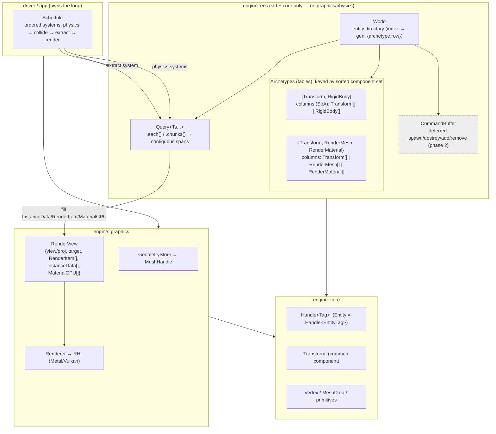

# 2026-07-03 — ECS Plan (for review)

Design for `engine::ecs`, the core organizing model for simulation state (goals.md). This is
a **plan for review** — nothing implemented yet. Decisions to confirm are collected in §11.

Ties into: goals.md (ECS core; data-oriented/throughput; determinism; parallel envs), the
geometry-scaling note (generational handles), and the RHI plan (the `RenderView` contract the
render-extraction system will produce).

---

## 0. TL;DR (what I propose)

1. A standalone **`engine::ecs`** module depending only on the standard library (and maybe
   `core` for the `Handle` type). No graphics/physics/GLFW dependency — graphics is a consumer.
2. **Archetype (table) storage**: entities with the same set of component types are stored
   together in contiguous per-component columns (SoA). Best cache/iteration behavior and it
   pairs naturally with batched instanced rendering + the 100k case. (Analysis + the
   sparse-set alternative in §3.)
3. **Generational `Entity` handle** — same pattern as `rhi::Handle`; this is the second real
   consumer, so promote a shared `Handle` into `core/memory/` (per the deferred-memory rule).
4. **Components are plain structs** defined by the *consumer* (engine subsystems or the app),
   not baked into `ecs`. Compile-time component type ids (no manual registration).
5. **Queries** iterate matching archetypes and hand systems contiguous spans → tight inner
   loops. Structural changes during iteration go through a **command buffer**, applied at sync
   points.
6. **Systems** run in a fixed order (deterministic); **parallelism** comes first *across
   worlds* (ML envs) and later *within* a system (chunked archetypes).

---

## 0.5 Architecture diagram



Dashed = later phase. Key points: `ecs` depends only on `core` (never on graphics/physics —
they're *consumers*); the extraction system is the bridge that turns archetype-contiguous
component data into a `RenderView` the existing `Renderer` already consumes; `Entity` and GPU
resource handles share one `core::Handle<Tag>`.

---

## 1. Requirements (from the goals)

| Driver | ECS implication |
|---|---|
| Data-oriented, cache-friendly | Contiguous component storage; iterate without pointer-chasing. |
| Throughput (ML), 100k+ entities | Cheap bulk iteration; 100k homogeneous entities = one tight loop. |
| Batched/instanced rendering | Extraction reads a whole archetype → fills an instance buffer with minimal per-entity work. |
| Parallel environments (training) | Many independent **worlds** stepped in parallel; no shared mutable state. |
| Determinism (ML reproducibility) | Fixed system order + stable iteration order; no hash-order dependence in hot paths. |
| Engine, not app | `ecs` is a generic container; subsystems/app define components + systems. |
| No backend coupling | `ecs` must not depend on graphics/physics; those are consumers. |

---

## 2. Entity model

```cpp
namespace engine::ecs {
struct Entity {                 // generational handle (same pattern as rhi::Handle)
    uint32_t index      = 0xFFFF'FFFF;
    uint32_t generation = 0;
    bool valid() const { return index != 0xFFFF'FFFF; }
    bool operator==(const Entity&) const = default;
};
}
```
The `World` keeps an entity directory: `index -> { generation, location }` where `location`
is `{ archetype id, row }`. Destroying an entity bumps its generation so stale handles fail.

> This is the **second consumer** of the generational-handle pattern (after `rhi::Handle`).
> Per the memory rule in the core plan, promote a shared `core::Handle<Tag>` into
> `core/memory/handle.h` and have both `rhi` and `ecs` use it.

---

## 3. Storage: archetype vs sparse-set

**Sparse-set** (e.g. EnTT default): one dense array per component type + a sparse
entity→dense map. O(1) add/remove/has; single-component iteration is contiguous, but
multi-component queries iterate the smallest pool and random-access the others (cache misses)
unless "groups" are configured.

**Archetype / table** (e.g. flecs, Unity DOTS): entities sharing a component set live in one
*table* with a contiguous column per component (SoA). Multi-component iteration is fully
contiguous and SIMD-friendly. Cost: a structural change (add/remove component) **moves** the
entity's row to another table; more complex implementation (table graph, moves).

**Recommendation: archetype.** Our hottest paths are multi-component bulk iterations (render
extraction over `Transform+Mesh+Material`; physics over `Transform+RigidBody`), we want
100k homogeneous entities to be one contiguous sweep, and structural changes in a sim are
comparatively rare (spawn/despawn, not per-frame component churn) — exactly where archetypes
are weakest and sparse-sets win. Archetype also feeds the instanced render path most directly.
The extra implementation cost is worth it for the stated throughput/cache goals.

Mitigation: keep the **query API storage-agnostic** (see §5) so the storage engine could be
swapped/tuned later without rewriting systems.

---

## 4. Components

- **Plain structs**, defined by the consumer. `ecs` provides no domain components; the
  milestone driver defines `Transform`, `RenderMesh { render::MeshHandle }`, `RenderMaterial`,
  `RigidBody`, `Collider`, etc. (Keeps `ecs` decoupled from graphics/physics.)
- **Compile-time component ids**: a `ComponentId typeId<T>()` backed by a static counter — no
  manual registration. Store per-component size/alignment (and, if we allow non-trivial types,
  move+destroy function pointers).
- **Initial constraint (proposed): trivially-relocatable components** so moving a row between
  tables is a `memcpy`. Simpler + fastest; relax to non-trivial (with move/dtor thunks) only if
  a real need appears.

---

## 5. Queries & iteration

```cpp
world.query<Transform, const RenderMesh>().each(
    [](Entity e, Transform& t, const RenderMesh& m) { /* ... */ });

// or chunk-wise for tight/vectorizable loops:
world.query<Transform, RigidBody>().chunks(
    [](std::span<Transform> xs, std::span<RigidBody> rbs) { /* SoA inner loop */ });
```
A query matches all archetypes whose component set is a superset of the requested types, and
yields contiguous columns per archetype. `const` in the query marks read-only access (used
later for parallel scheduling). Iteration order is stable (archetypes by id, rows by slot).

---

## 6. Structural changes (command buffer)

You can't move rows between tables while iterating them. So spawn/despawn and add/remove during
a system are **recorded** into a per-world (or per-system) `CommandBuffer` and **applied at sync
points** (end of system / end of frame):
```cpp
cmds.spawn(Transform{...}, RigidBody{...});
cmds.add<Collider>(e, Collider{...});
cmds.destroy(e);
```
Immediate (non-iterating) structural changes can also be applied directly via the `World`.

---

## 7. Systems & scheduling

- A **system** is a callable taking the `World` (or pre-bound queries) + **resources** (shared
  singletons like `Time{dt}`, camera, config) from a typed resource store.
- A **schedule** is an ordered list of systems (stages: e.g. `input → physics → transforms →
  extract → render`). Fixed order ⇒ deterministic.
- **Parallelism, phased**:
  1. *Across worlds* (ML envs): each world stepped on its own thread/task — trivially parallel,
     no shared state. Biggest throughput win; comes first.
  2. *Within a system* (later): chunked archetype iteration via a task pool; a system declares
     its component reads/writes so non-conflicting systems can overlap. Determinism preserved by
     stable partitioning.

---

## 8. Worlds (parallel environments)

`World` is a self-contained value: entities + archetypes + resources. Parallel training =
`std::vector<World>` stepped with a task pool (one world per task). One `rhi::Device` per
process is shared for rendering only where needed; pure-sim worlds touch no graphics. This
directly serves the "many parallel envs, headless" goal.

---

## 9. Integration

- **Render extraction** (a system): `query<Transform, RenderMesh, RenderMaterial>` →
  cull → fill `render::InstanceData[]` + `RenderItem[]` + `MaterialGPU[]` → emit a
  `render::RenderView`. Archetype-contiguous iteration makes this a fast, near-`memcpy` fill of
  the instance buffer. Lives in a bridge/driver that depends on both `ecs` and `graphics`
  (keeps `ecs` graphics-free). Components hold lightweight `render::MeshHandle`/`MaterialHandle`.
- **Physics** (systems): `query<Transform, RigidBody, Collider>` → integrate + collide → write
  `Transform`. The renderer never sees physics; it reads `Transform`.
- **`core`**: `ecs` may use `core::Handle` (promoted) and later `core::Transform`/math if we
  un-defer them; otherwise it's std-only.

---

## 10. Milestone mapping — "ball rolling down a plane"

Driver-defined components: `Transform { vec3 pos; quat rot; vec3 scale }`,
`RenderMesh { MeshHandle }`, `RenderMaterial { MaterialHandle }`, `RigidBody { vec3 vel; ... }`,
`Collider { sphere|plane }`.
- Entities: `plane` (Transform + RenderMesh + Collider), `ball` (Transform + RenderMesh +
  RigidBody + Collider).
- Schedule per step: `physics_integrate` (gravity → vel → pos) → `collide` (ball vs plane) →
  `extract` (→ RenderView) → `Renderer.render`.
- **100k spheres**: 100k ball entities in one archetype → one contiguous extraction sweep → one
  instanced draw (already working). This is where archetype storage pays off.

---

## 11. Decisions (owner, 2026-07-03)

> **DECIDED**: (1) **archetype** storage. (2) **trivially-relocatable** components to start.
> (3) **compile-time** component ids. (4) **promote `Handle`** to `core/memory/`. (5) **ship
> common components** — the engine provides them; **start with just `Transform`** (lives in
> `core` as `engine::Transform`, reusable by ecs/physics/render). (6) **simple ordered
> scheduler** first; parallel scheduler deferred.

1. Storage: **archetype**.
2. Components: **trivially-relocatable** to start (memcpy row moves); relax later if needed.
3. Component ids: **compile-time** static counter.
4. **Promote `Handle`** to `core/memory/handle.h`; `rhi` and `ecs` both use it.
5. **Ship common components**, beginning with `engine::Transform` in `core` (un-defers the
   previously-deferred Transform — ecs/render are now its consumers). More (render/physics
   component structs) added as their subsystems land.
6. Scheduler: **ordered system list** now; read/write-declared parallel scheduler deferred.

---

## 12. Suggested phasing

1. `Entity` + `World` + archetype storage + `query().each()/.chunks()` (single-threaded).
   Driver test: spawn N entities, iterate, assert.
2. Command buffer + deferred structural changes.
3. Resource store + ordered system scheduler.
4. **Render extraction system → `RenderView`** wired to the existing `Renderer`; render an
   ECS-driven static scene (reuses everything built so far).
5. Physics components/systems → the ball actually rolls down the plane.
6. Parallel worlds (ML) + chunked within-system parallelism + determinism review.

Each phase keeps the build green and is independently reviewable.
