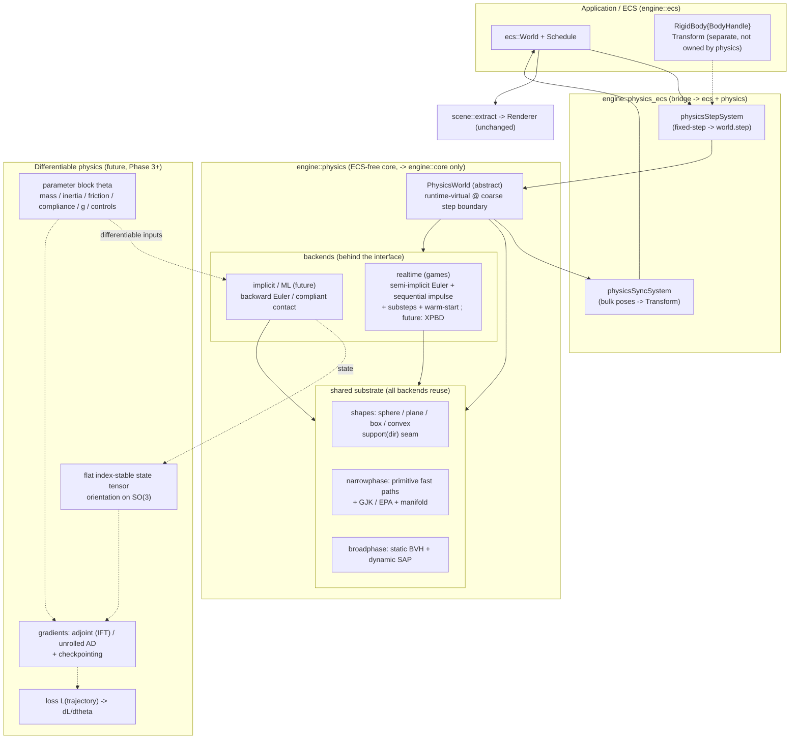

# 2026-07-03 — Physics Plan

Design for the physics layer, worked **backward from the three workloads (realtime / ML /
render), the milestone ("ball rolling down a plane" → parallel → 100k), and determinism**.
Mirrors the structure of [2026-07-02-rhi-interface-plan.md](2026-07-02-rhi-interface-plan.md)
but does **not** copy its dispatch choice — see §1.

Status: **plan only, no physics code written yet.** Today `engine::physics` is a stub
(`Physics::test()` prints "hello physics"). ECS foundation (World, archetypes, queries,
resources, ordered `Schedule`), `core::Transform`, `core::Handle`, and the render-extraction
bridge (`engine::scene`) already exist and are the surfaces physics plugs into.

---

## 0. TL;DR (proposed decisions)

1. **Multi-backend behind a common interface — but runtime-virtual at a *coarse* boundary,
   not compile-time like the RHI.** The graphics RHI compiles exactly one backend per binary;
   physics must run **several backends in the same process** (a game solver and an ML solver,
   possibly different backends per parallel env). Stepping is coarse (one `step(dt)` per world
   per tick), so a virtual call at the world/step granularity costs nothing, while the hot
   inner loops (integrate N bodies, resolve M contacts) stay inside the backend as tight
   data-oriented code with no per-body virtual calls.
2. **The abstraction boundary is narrower than the RHI's.** Only the **integrator + constraint
   solver** vary per backend. **Collision detection (GJK/EPA + primitive fast paths) and the
   broadphase (BVH/SAP) are a *shared* substrate** every backend reuses. So physics = a big
   common library + a thin per-backend solver, not fully parallel backends.
3. **Two initial backends:** `realtime` (semi-implicit/symplectic Euler + sequential-impulse
   contact solver, substeps; fast, approximate — games) and `implicit` (integrator-pluggable:
   backward Euler / RK4, stable at large stiff `dt`, strict deterministic ordering — ML). Ship
   `realtime` first; adding `implicit` is what *validates* the interface.
4. **Rotational rigid-body dynamics from the start** (mass + inverse inertia tensor +
   orientation quaternion + angular velocity; contact impulses apply torque at the contact
   point) — required for *true rolling*, which reads visually as rotation + tangential
   friction, not translation.
5. **Backend owns simulation state; ECS syncs from it.** `RigidBody{ BodyHandle }` is the ECS
   component; the world owns packed SoA body state; a bulk sync system copies poses →
   `Transform` each step (batched, not per-body virtual). This matches how PhysX/Bullet
   integrate with an ECS and lets the ML backend use whatever internal layout (e.g.
   generalized coordinates) it needs.
6. **Fixed timestep + accumulator** (a `FixedStep{dt}` resource) for reproducibility;
   deterministic broadphase + solver iteration order. Determinism scope = **same-binary
   reproducibility** first; cross-platform bit-exactness is a separate, expensive goal (§8).
7. **Two broadphase structures** as the milestone hints: a **static BVH** built once (ground /
   level geometry) + a **dynamic** structure (SAP or a refit dynamic BVH) for moving bodies;
   dynamic AABBs are queried against both. Sized for the 100k case.

Open decisions collected in §11.

---

## 0.5 Architecture diagram

Solid = planned/near-term (Phases 0–2). Dashed = future (Phase 3+, incl. differentiability).



---

## 1. Dispatch: why NOT the RHI's compile-time model

| | Graphics RHI | Physics |
|---|---|---|
| Backends in one binary | exactly **one** (Metal *or* Vulkan) | **many** (game + ML, per-env) |
| Call granularity | per-draw, per-resource (hot) | per-world-`step` (coarse) |
| Cost of a virtual call | unacceptable per draw | negligible per step |
| What differs per backend | *everything* (whole GPU API) | *only* integrator + solver |
| Selection time | compile time (CMake define) | **runtime** (factory / per world) |

Conclusion: physics uses a **runtime abstract `PhysicsWorld`** created by a factory, with the
concrete hot code non-virtual inside each backend. The RHI's principle ("virtual only at
coarse boundaries, handles/flat data in the hot path") is preserved — the *boundary* is just
in a different place. Rejected: compile-time single-backend physics (kills coexisting
game+ML worlds); per-body virtual dispatch (defeats data-oriented stepping).

---

## 2. Requirements (backward from goals)

| Driver | Physics implication |
|---|---|
| One engine, 3 workloads | A common `PhysicsWorld` interface; swappable integrator/solver backends chosen at runtime. |
| ML: deterministic, specific integrators (backward Euler) | An `implicit` backend with a **pluggable integration scheme**; fixed timestep; deterministic ordering; reproducible within a binary. |
| Games: simple + performant | A `realtime` backend: symplectic Euler + sequential impulse + substeps; approximate but fast and stable. |
| Milestone: ball rolls down plane | Gravity, rotational dynamics, sphere/plane colliders (exact fast paths), restitution + friction → rolling. |
| Parallel simulations | Worlds are cheap to instantiate by the hundreds; each env owns its state; step N worlds across a job pool. |
| ~100k bodies | Broadphase with good scaling (BVH/SAP); packed SoA body state; static/dynamic split; no per-pair allocation. |
| Collisions: plane, sphere, point, **any polygon** | Convex collision via **GJK** (overlap/distance) + **EPA** (penetration depth/normal) + manifold generation; primitive fast paths for the common exact cases. |
| Headless first-class | Physics never needs a `Device`; pure CPU (compute-offload is a later option). |
| Determinism | Fixed-order iteration, fixed timestep, stable pair ordering, controlled FP reductions. |

---

## 3. Layering & module shape

Physics-core is **ECS-agnostic** (usable headless without the ECS); a thin **bridge** adds ECS
components + systems (mirrors how `engine::scene` bridges ECS↔render). This keeps the solver
reusable and testable in isolation.

```
engine::physics  (core, depends on engine::core only — NO ecs, NO graphics)
  shapes/        Sphere, Plane, HalfSpace, Box, Capsule, ConvexHull, Point
                 + support(dir) function per convex shape (drives GJK)
  collision/     gjk, epa, manifold (clip/contact points),
                 primitives (sphere-sphere, sphere-plane, sphere-box exact fast paths)
  broadphase/    aabb, bvh (static), sap / dynamic-bvh (dynamic), pair cache
  dynamics/      Body (mass, invMass, invInertia, pose, linVel, angVel, material),
                 Contact / ContactManifold, integrate helpers
  world.h        abstract PhysicsWorld + BodyDef + WorldDef + factory(Backend)
  backends/
    realtime/    SequentialImpulseWorld  (symplectic Euler + PGS impulses + substeps)
    implicit/    ImplicitWorld           (integrator-pluggable: BackwardEuler, RK4, ...)

engine::physics_ecs  (bridge, depends on engine::physics + engine::ecs)   [see §11-Q3]
  components.h   RigidBody{ BodyHandle }, ColliderRef, (Mass/Material optional)
  systems.h      physicsStepSystem (accumulator → world.step), physicsSyncSystem (poses→Transform)
```

Ownership rules (parallel to the RHI plan):
- **`PhysicsWorld`** owns all body/collider/contact state in packed pools; one per env.
- **Shapes** are immutable and **shareable** across bodies and across worlds (a shape
  registry) — 100k spheres reference one sphere shape.
- **Collision + broadphase** are shared libraries the backends call; they own no dynamics.
- **ECS** owns entity/Transform truth for *rendering*; the physics world owns *dynamics*
  truth; the sync system is the one-way bridge (world → Transform) each step.

---

## 4. The common interface (sketch)

```cpp
namespace engine::physics {

using BodyHandle  = core::Handle<struct BodyTag>;
using ShapeHandle = core::Handle<struct ShapeTag>;

enum class BodyType { Static, Kinematic, Dynamic };

struct PhysicsMaterial { float restitution = 0.2f; float friction = 0.5f; };

struct BodyDef {
    Transform       pose;
    glm::vec3       linearVelocity{0};
    glm::vec3       angularVelocity{0};
    float           mass = 1.0f;         // ignored for Static/Kinematic
    ShapeHandle     shape;
    PhysicsMaterial material;
    BodyType        type = BodyType::Dynamic;
};

struct WorldDef { glm::vec3 gravity{0, -9.81f, 0}; };

class PhysicsWorld {                       // abstract; runtime-virtual at coarse boundary
public:
    virtual ~PhysicsWorld() = default;

    virtual ShapeHandle createShape(const ShapeDesc&) = 0;   // shared registry-backed
    virtual BodyHandle  createBody(const BodyDef&)    = 0;
    virtual void        destroyBody(BodyHandle)       = 0;

    virtual void setGravity(glm::vec3)                = 0;
    virtual void step(float dt)                       = 0;   // fixed dt; substeps internal

    // BULK, non-virtual-per-body readback for sync/rendering:
    virtual std::span<const Transform>   poses()      const = 0;   // indexed by BodyHandle.index
    virtual std::span<const glm::vec3>   linearVel()  const = 0;
    virtual std::span<const ContactEvent> contacts()  const = 0;   // this step

    // scene queries:
    virtual bool raycast(const Ray&, RayHit& out) const = 0;
};

enum class Backend { Realtime, Implicit };
std::unique_ptr<PhysicsWorld> createPhysicsWorld(Backend, const WorldDef&);

} // namespace engine::physics
```

Note the readback is **bulk spans** (one virtual call returns a flat array), so the ECS sync
does a single batched copy — no per-body virtual dispatch even for 100k bodies.

---

## 5. Collision (shared substrate)

Pipeline: **broadphase → narrowphase → manifold → solver**.

- **Shapes & support functions.** Each convex shape implements `support(dir) → farthest point`.
  That single function powers GJK/EPA for *any* convex (sphere, box, capsule, convex hull,
  point, and arbitrary convex polygon/polyhedron). Non-convex meshes decompose into convex
  pieces (later).
- **Fast paths first.** `sphere-sphere`, `sphere-halfspace/plane`, `sphere-box` have closed-form
  tests — exact, branch-light, and they cover the **milestone** and the 100k-sphere case
  without touching GJK. The dispatcher picks the fast path by shape-type pair, else falls back
  to GJK/EPA.
- **GJK** for boolean overlap + closest distance between convex shapes (Minkowski-difference
  simplex search).
- **EPA** (Expanding Polytope Algorithm) for penetration depth + contact normal when GJK
  reports overlap.
- **Manifold generation**: from normal + witness features, clip to get up to N contact points
  (needed for stable box/polygon resting contact; a sphere gives a single point).
- **Contact caching / warm-starting**: persistent manifolds keyed by body pair id → reuse last
  frame's impulses for solver stability (realtime backend).

---

## 6. Broadphase / acceleration structures

Two structures (the milestone explicitly wants static/dynamic separation):

- **Static BVH** — built once over static geometry (ground plane, level meshes). Median/SAH
  split, immutable, cache-friendly. Dynamic bodies query it each step.
- **Dynamic broadphase** — **SAP (sweep-and-prune)** on sorted AABB endpoints is a strong first
  choice for many similar-sized bodies (100k spheres); alternatively a **refit/incremental
  dynamic BVH** (Bullet-style `btDbvt`). Start with SAP; benchmark vs dynamic BVH at scale.
- **AABBs** with a fattening margin so small motions don't force rebuilds.
- Output is a **pair list** (potentially-colliding pairs), fed to narrowphase. Pair ordering is
  sorted deterministically (by body index pair) for reproducibility.

Parallel-worlds note: each env has its own dynamic broadphase; a **shared** static BVH can be
referenced read-only by many envs if their static geometry is identical (common in ML).

---

## 7. Dynamics & rotation (true rolling)

Rigid body state (per dynamic body, SoA):

```
pose (Transform: position + orientation quat + scale=1)
linearVelocity   v
angularVelocity  ω
invMass          (0 for static/kinematic)
invInertiaLocal  (body-space inverse inertia tensor; sphere = 2/5 m r² · I)
material         (restitution, friction)
```

Per step (realtime backend):
1. **Integrate velocity** from gravity/forces (symplectic: `v += g·dt` before position).
2. **Broadphase → narrowphase → manifolds.**
3. **Sequential-impulse solver** (PGS, K iterations): for each contact, solve normal impulse
   (with restitution + Baumgarte/position bias for penetration) then friction impulse
   (clamped by μ·normalImpulse) at the **contact point** — the `r × impulse` term produces
   angular velocity ⇒ the sphere spins up as friction opposes sliding ⇒ **rolling**.
4. **Integrate position + orientation** (`pos += v·dt`; integrate quat from ω, renormalize).
5. Emit `ContactEvent`s.

Rolling specifically emerges from friction impulses applying torque; without angular dynamics
the ball would slide, not roll. Rolling-resistance/drag can be added later.

The **implicit** backend replaces steps 1/3/4 with a linearized implicit solve (backward
Euler): assemble the system, solve (matrix-free CG or a small sparse solve), unconditionally
stable for stiff cases — the ML-oriented path where large/robust `dt` and reproducibility beat
raw speed.

---

## 8. Determinism

- **Fixed timestep + accumulator** (`FixedStep{ dt, maxSubsteps }` resource). The step system
  drains accumulated real time in fixed `dt` chunks; render interpolates between the last two
  states (optional).
- **Deterministic ordering**: stable body indices, sorted broadphase pairs, fixed solver
  iteration counts and traversal order.
- **FP reproducibility scope**: **same binary / same platform** first (achievable). Bit-exact
  **cross-platform** determinism (fma, x87, SIMD reassociation, math-lib differences) is a
  separate, expensive commitment — call it out but don't block on it. Parallel reductions must
  use fixed reduction order if enabled.
- ML consequence: same seed + same inputs ⇒ identical trajectories, run to run.

---

## 9. ECS integration

- Components (in the `physics_ecs` bridge): `RigidBody{ BodyHandle }`, and a spawn-time
  `ColliderRef` / `BodyDef`-carrying component.
- **Spawn**: creating an entity with a body registers it in the `PhysicsWorld`, stores the
  returned `BodyHandle` in `RigidBody`.
- **Systems** (added to the ordered `Schedule`):
  - `physicsStepSystem`: accumulator → `world.step(dt)` (fixed steps).
  - `physicsSyncSystem`: bulk-copy `world.poses()` → each entity's `Transform` (bridge for
    the render extraction that already exists).
- This slots cleanly into the existing `update → extract → render` loop: physics writes
  Transforms, `scene::extract` reads them — no new coupling in the Renderer.

---

## 10. Milestone slice & phasing

**Vertical slice (ball rolls down a plane):** `realtime` backend, sphere + static plane
(half-space) via fast paths, gravity, semi-implicit Euler, one-contact resolution with
restitution + friction, rotational dynamics, fixed timestep. ECS `RigidBody` → sync →
`Transform` → `scene::extract` → Renderer. Headless test asserts: height decreases, downslope
velocity increases, and angular velocity becomes non-zero (it rolls, not slides).

- **Phase 0 — shared kernels (no backend yet):** `shapes/`, AABB, primitive fast paths
  (sphere-sphere, sphere-plane), `Body` state + inertia, integrate helpers. Unit-tested
  headless (analytic checks: free-fall position, sphere-plane contact normal/depth).
- **Phase 1 — realtime backend + interface + ECS bridge + MILESTONE.** `PhysicsWorld`
  interface, `SequentialImpulseWorld`, `physics_ecs` systems, fixed timestep, rotation. Wire
  into `visual_window`. Headless "ball rolls down incline" test.
- **Phase 2 — general collision + broadphase (scale).** GJK/EPA, box/capsule/convex-hull +
  polygon, manifold clipping, SAP + static BVH. Stress test toward 100k; benchmark SAP vs
  dynamic BVH.
- **Phase 3 — implicit/ML backend + parallel worlds + determinism harness.** Integrator-
  pluggable `ImplicitWorld` (backward Euler / RK4); step N worlds across a job pool; a
  reproducibility test (same seed ⇒ identical trajectories). *Validates the interface by
  being the 2nd backend.*
- **Phase 4 (later):** CCD (fast small spheres tunneling), joints/constraints, sleeping/
  islands, non-convex decomposition, compute-offload of broadphase/integration, possibly
  differentiable physics for ML gradients.

---

## 11. Decisions & open questions

**Decided (owner, 2026-07-03):**
- **Q1 — Dispatch: runtime-virtual `PhysicsWorld`** (coarse boundary), concrete non-virtual
  hot loops. ✅
- **Q4 — Determinism scope: same-binary reproducibility now**, cross-platform bit-exact is a
  later, separate goal. ✅
- **Q6 — Conventions: right-handed, y-up, meters, gravity `-9.81 y`** (matches render/glm). ✅
- **Q7 — Dynamic broadphase: SAP first**, benchmark vs dynamic BVH in Phase 2. ✅
- **Q8 — Differentiable physics IS a goal.** Gradients through the step (for learning) are an
  eventual target. This constrains the ML/implicit backend: state must be a contiguous,
  index-stable tensor with a well-defined `state_{t+1}=f(state_t, θ)` and an adjoint;
  contacts will likely use a **compliant/soft** formulation (smoother gradients) + analytic
  (implicit-function-theorem) or unrolled autodiff. It also settles Q2 toward backend-owned
  state (see below). Detection stays shared; only the ML solver differs.

**Still under discussion (Q2, Q3, Q5) — leanings below, pending confirmation:**
- **Q2 — State ownership: backend-owns-state + bulk ECS sync.** ✅ (owner, 2026-07-03) Q8
  effectively forces this for the ML backend (contiguous, index-stable state tensor for
  adjoints / backprop-through-time); serves realtime + parallel worlds too.
  - **Transform vs RigidBody — keep them separate, composed; no inheritance, no replacement.**
    (owner, 2026-07-03) `Transform` stays the single universal pose interface (rendering,
    culling, queries, gameplay all read it; physics is just one producer, only for dynamic
    bodies). `RigidBody = { BodyHandle }` — a handle into the world's arrays, **no pose stored
    in the ECS** (so no in-ECS duplication). Rejected: (a) *dropping* Transform when a
    RigidBody is present → forces every spatial consumer to branch / breaks the
    `<Transform, RenderMesh>` extraction contract; (b) `RigidBody : Transform` *inheritance* →
    fights composition storage (would land in the RigidBody column, invisible to
    `query<Transform>`), buys nothing. **"No Transform" is instead achieved by composition**:
    the pure-ML/headless path simply omits Transform + the sync system and reads world state
    tensors directly (enabled by the ECS-free core, Q3). Authority is one-way: physics owns
    the pose for physical bodies; gameplay teleports go through the world API, never by writing
    Transform directly.
- **Q3 — Module split: two targets** `engine::physics` (ECS-free core) + `engine::physics_ecs`
  (bridge). ✅ (owner, 2026-07-03) The ML training loop is a real ECS-free consumer of the
  core → not speculative. Bridge is its own target (NOT folded into `scene`, which pulls
  graphics).
- **Q5 — Realtime contact solver: sequential impulse (PGS) + substeps + warm-start.** ✅
  (owner, 2026-07-03) **Future: attempt PBD/XPBD.** Differentiable-contact concern lives in
  the implicit ML backend (compliant contacts + adjoints), not here — a key reason to keep
  solvers separate but detection shared.

---

## 12. What this reuses / touches

- **Reuses**: `core::Transform`, `core::Handle`, glm; the ECS `World`/`Query`/`Schedule`/
  resources; the existing `scene::extract → Renderer` render path (physics only writes
  Transforms).
- **New in `core` (trigger arrived)**: shape/math primitives may promote to `core` once both
  physics and (e.g.) culling use them — start them in `physics/shapes/` and promote on the 2nd
  consumer (YAGNI).
- **No graphics dependency** anywhere in physics.

---

## 13. Differentiable & implicit backend (design-ahead, Phase 3+)

Not implemented for a while, but the design below is what Phase 0/1 must stay compatible with.
The goal (Q8): compute gradients of a scalar loss `L(trajectory)` w.r.t. parameters `θ`
(initial state, masses/inertia, material params, controls, gravity, even shape params), so the
sim can be dropped into gradient-based learning / trajectory-opt / system-id.

### 13.1 The step as a differentiable map
Model each step as `s_{t+1} = f(s_t, θ, u_t)` with `s` the full state, `θ` params, `u` controls.
Gradients of `L` come by chaining vector-Jacobian products backward across `T` steps
(backprop-through-time / the adjoint method).

Two gradient routes, both kept open:
- **Analytic adjoint / implicit differentiation.** A step defined by solving `g(s_{t+1}, s_t,
  θ)=0` (implicit integrator, or a contact solve at its fixed point) gets `∂s_{t+1}/∂s_t` and
  `∂s_{t+1}/∂θ` from the **implicit function theorem** — no differentiating through solver
  iterations, iteration-count-independent, stable. Preferred for the solver core (cf. Dojo,
  OptNet).
- **Unrolled autodiff.** Reverse-mode AD through the op sequence; simpler to extend but
  O(T·state) memory → needs **checkpointing** (store state every k steps, recompute forward
  in the backward pass).

### 13.2 The hard part: contact is non-smooth
Hard contact is a complementarity condition (normal force ≥0, separation ≥0, complementary);
its gradients are discontinuous / a.e.-zero. Resolution (this is why the ML backend's solver
**differs** from the realtime PGS one):
- **Compliant / soft contact** (spring-damper or **XPBD compliance**): replace the hard
  constraint with a stiff-but-smooth force → finite, smooth gradients; stiffness is a tunable
  (and itself differentiable) parameter. This is the primary model — and it's exactly the
  PBD/XPBD direction Q5 already earmarked, so realtime-future and ML converge on compliance.
- **Implicit time-stepping + IFT** through the (relaxed) complementarity solution for harder
  contact when needed.
- **Randomized smoothing** (explicit, seeded) as a training-side fallback when analytic
  gradients are uninformative.

### 13.3 Integrator
Backward Euler (`v_{t+1}=v_t+h M⁻¹F(x_{t+1},v_{t+1})`, `x_{t+1}=x_t+h v_{t+1}`): solve the
nonlinear system per step (Newton; each iter a linear solve), unconditionally stable for stiff
compliant contacts/springs. The converged solution is differentiated via IFT (§13.1).
"Integrator-pluggable": semi-implicit / RK4 available for smooth (contact-free) accuracy.

### 13.4 State & parameters as tensors
- **State is one flat, contiguous tensor** with a fixed, documented layout, **index-stable for
  the whole rollout** (no body reordering mid-trajectory). Per rigid body:
  `[pos(3), quat(4), linVel(3), angVel(3)]`.
- **Orientation lives on a manifold.** Gradients live in the tangent space `so(3)`; orientation
  updates must use **differentiable exp/log maps** (not ad-hoc "add then renormalize", which
  corrupts gradients). ← concrete Phase-0 constraint (§14).
- **Everything differentiable-w.r.t. is data, never a constant**: mass, inverse inertia,
  restitution, friction, **compliance/stiffness**, gravity, control forces — all live in
  settable arrays exposed as a "parameter block."
- **Batch dimension for parallel envs**: state laid out to add an outer batch (worlds) cleanly,
  so many envs differentiate/step together and the layout stays GPU-portable (SoA, per-field
  contiguous). No GPU now; just don't preclude it.

### 13.5 AD mechanism — deferred, not precluded
Choice among (a) hand-written analytic adjoints, (b) a small in-house reverse-mode tape over
our math, (c) an external tool (e.g. Enzyme/LLVM autodiff). **Not decided now.** The obligation
on earlier phases is only to keep the step *adjoint-able*: pure functions of explicit
(state, params), no hidden mutable global state, explicit seeded RNG, checkpointable state.

---

## 14. Constraints propagated to Phase 0 / earlier phases

These are cheap disciplines (no speculative code) that keep §13 reachable. Phase 0 **must**
honor them:

1. **Pure kernels.** Integrate / contact / force helpers are free functions over explicit
   state + params (spans/values in, results out) — **no hidden mutable statics, no global
   RNG, no singletons.** (Also lets the realtime backend reuse them.)
2. **Orientation via exp/log maps.** Provide `so3ExpMap(rotvec)→quat` (+ `log`) and integrate
   orientation through it, not by `q += 0.5ωq; normalize`. Differentiable and 2nd-order-clean.
3. **Scalar type localized.** Introduce `physics::Real` (= `float` now). Use it consistently so
   a later switch to `double` / a dual/adjoint scalar is a localized change, not a rewrite.
   (Do **not** template everything now — YAGNI; just don't hardcode `float` everywhere.)
4. **Solver-agnostic contact data.** The `Contact`/manifold struct carries a **continuous
   signed separation** (+ normal, point(s), the two bodies) and does **not** bake in
   impulse-vs-compliant assumptions. Both a hard impulse solver and a compliant/soft force can
   consume the same manifold.
5. **Index-stable, checkpointable state.** Body storage keyed by stable index/handle; no
   reordering; deterministic iteration. State must be snapshot/restore-able.
6. **Params are data.** Mass, inertia, restitution, friction, (future) compliance, gravity all
   live in structs/arrays — never hardcoded constants in the step.
7. **Fixed timestep `h` is an explicit argument**, never baked into a kernel.
8. **Deterministic + explicit-seed randomness** (Phase 0 kernels are deterministic anyway).
